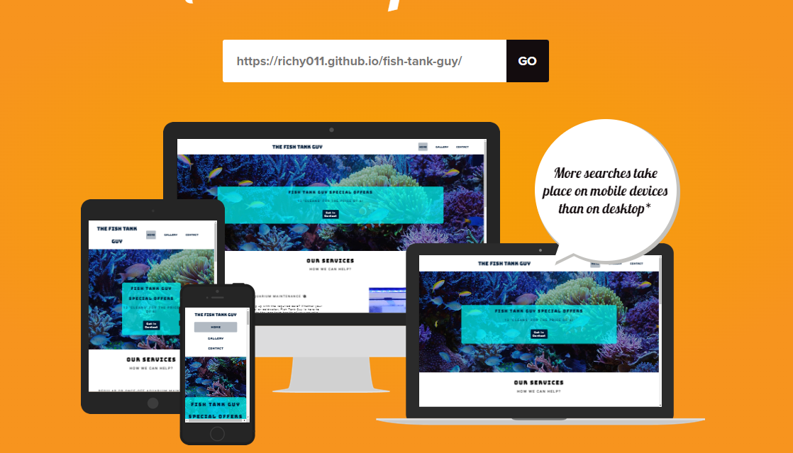
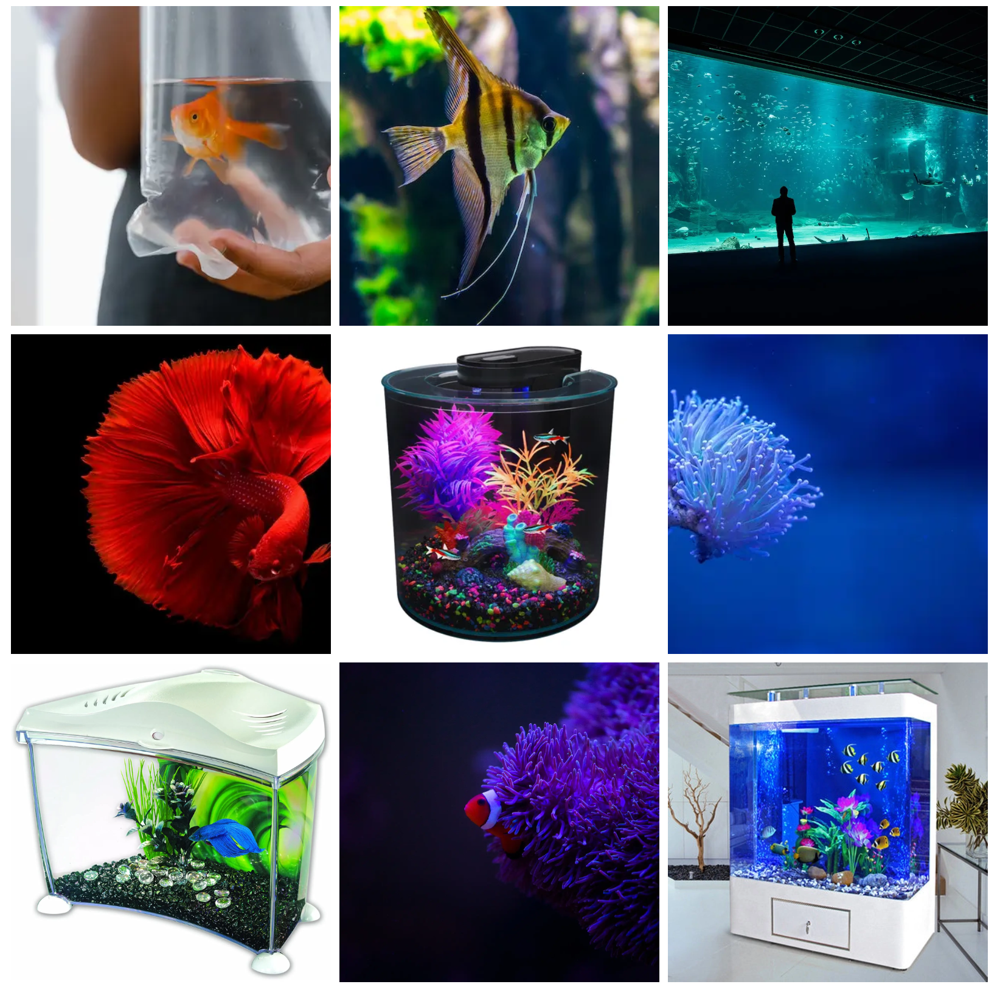

# Fish Tank Guy 
## A Platform for Aquarium Cleaning Services

Fish Tank Guy is an online platform designed to offer a wide range of services to the public on behalf of an aquarium cleaning business. Our 'coding' mission is to provide high-quality website platforms to service providers of all types. Our website and business model were chosen for their uniqueness and visual effect, making it an effective way to advertise aquarium cleaning services.

## [Live site](https://richy011.github.io/fish-tank-guy/https://richy011.github.io/fish-tank-guy/)

## Table of contents

 1. [ UX ](#ux)
 2. [ Features ](#features)  
 3. [ Visual design ](#vd)
 4. [ Technology used ](#tech)
 5. [ Future ideas ](#fi)
 5. [ Testing ](#testing)  
 6. [ Bugs ](#bugs)  
 7. [ Deployment](#deployment)
 8. [ Credits](#credits)
 9. [ Content](#content)  
 10. [ Acknowledgements](#acknowledgements)  

## UX

### Pre-Project Planning

To create a website that meets the needs of our client's customers, we started by identifying the purpose of this project. Our goal was to develop the skills required to provide a website for a client or employer that meets their needs. Selling a service to clean aquaria or selling fish and fish tanks online is similar in design and functionality to selling most other services and products. By providing a site that is functionally easy to use and presents the services and products on offer in a visually attractive manner, we are meeting customer needs and providing an enjoyable experience. This precedent will be used for the design and implementation of future coding projects.

Our virtual challenge includes avid aquarium enthusiasts who recognized a gap in the market for aquarium cleaning services in Dublin. We decided to build this platform to advertise the services of a professional cleaner and provide a unique online experience for aquarium owners. Fish Tank Guy meets the needs of its target audience, which includes fish enthusiasts, those with accessibility issues who are fish owners and require one of these services, and clients that want similar functionality, visual effects, and customer experience for their own website.

### UX Features

Fish Tank Guy offers a range of features to provide a positive user experience, including:
-	A clean and simple design that prioritizes readability and ease of navigation.
-	A simple and intuitive menu system that allows users to browse different sections of the website easily.
-	A responsive design that adapts to different screen sizes and devices.
-	Accessibility guidelines, including providing alternative text for images and using high-contrast colors for text and backgrounds.
-	Clear presentation of services with visual cues.
-	Prominent placement of the image overlay to promote offers.
-	A call-to-action via the ‘Get in Touch’ button, thus improving the chance of customer conversion.
-	A service that allows visitors to select an appointment time to suit their needs.
-	Links to social media accounts to help visitors follow the service provider.
-	Links in the footer to facilitate contacting the service provider and also a Google Maps link to help visitors find the location and read reviews.
-	A gallery showcasing the tanks and fish the business has provided in the past.
-	A visually pleasing and functionally simple interface for customers, with never more than two clicks to a ‘purchase.’

## Features

### Page Elements

**All pages** 

-	Cover text is present on the top background image on every page, taking every opportunity to advertise and engage a sale.
-	The Navbar is simple, providing only three options to maintain the minimalist style.
-	The Logo text is animated highlighting the brand everytime on page loading. 
-	The nav bar moves from horizontal to vertical for smaller screen sizes
-	Added favicon for all screen sizes and 

Header

-	Contains the requisite meta tags for SEO 
-   Favicon links
-   Lighthouse recommendation on page load speed including *preload* for the css style and 'dns-prefetch' and 'preconnect' for fontawesome.
-   Ever important title

Footer
-	Located at the bottom of every page, highlighting contact, opening hours and a google embedded iframe to help customers find us
-	Made of four columns, changing shape for larger or smaller devices.
-	The first column contains information about business and the people behind it.
-	The second contains the terms of service
-	The third column contains an iframe embedded google map with lazy loading for optimal page speed
-	The fourth column contains contact information via phone and email, plus the variable opening hours.

**Home Page**

Main background image
-	Used an image that highlights a beautiful aquatic scene within a large aquarium. Includes an image overlay designed without using ‘position’ with flex box.

Our services section
-	Services are listed by row with brief descriptions and visual cues with action buttons
-	Integrated preconnect and dns-prefetch to improve load speed for fontawsome and a preload command to expedite loading of the css style sheet.
-	Contrasting background colour used on middle row to define the against other contents, especially on smaller screen sizes
-	The section is responsive and the 3 rows will stack on resize.
-	All images are responsive.
-	Links through to call to action

**The Gallery**

-	Each photo evokes a positive reaction and informs visitors about the fact that we also sell products as well as services

**Contact Page** 

-	The form has validation and is fully responsive.
-	Includes options on the method of feedback via email or phone.
-	Autocomplete is active
-	Drop down phone number prefix and calendar date appointment option
-	The form fields will be cleared only on a successful response.

## Visual Design

I tried to create a visually pleasing website design that includes the following elements:

**Wireframes** 

You can view my wireframe mock ups here [Wireframes](https://docs.google.com/document/d/1VKzS65QFWQ1jMNXBfkjJ-B_WNu9sWXAYiagH7xU2zGE/edit?usp=sharing)

**Fonts:**
We used Bungee as the primary font to create a fun and engaging website experience. To complement Bungee, we selected Roboto for its good contrasting and good-looking set of complimentary fonts.
 
[Roboto Font](https://fonts.google.com/specimen/Roboto) 

[Bungee Font](https://fonts.google.com/specimen/Bungee)

**Colours:**
We drew our palette from the background image, which features calming and pleasing colours that regularly trend on [coolors.co.uk](https://coolors.co/palettes/trending). Our palette includes navy, dark blue, sky blue, yellow, and turquoise/aqua marine. 

**Images** 

We know that images sell products, and beautiful images of tanks and fish for sale will draw customers further into the site. We used high-definition images sourced mainly from Pexels, an excellent free resource.

-	Images sell product and beautiful images of tanks and fish for sale will draw customers further into the site. Some background images of the one of the largest aquarium in the world in Georgia, USA look nice too!
-	Images are high definition and sourced mainly from Pexels, an excellent free resource 
-	Images are organised using flexbox styling and definitely add to the user experience
-	The main title is animated with key frames on loading

## Technologies Used 

### Languages
-	HTML - Page markup.
-	CSS - Styling.
-	Javascript -	Running fontawesome and google maps

### Libraries
-	Google Fonts - Font Styles.
-	Fontawesome - Used for icons

### APIs
-	Google Maps Javascript API - Map, markers and styles.

### Platforms
-	Github - Storing code remotely and deployment.
-	Gitpod - IDE for project development.

### Other Tools
-	Favicon Generator - Favicons
-	Mockup Generator - For device mockup images.
-	Coolors - Creating color pallettes.
-	Pexels - Free HD photos

## Feature Ideas

### Basic

-	A range of dates to offer clients for an appoitnment
-	The ability to share photos directly to social media.
-	Purchasing on the site
-	Feedback on the success or not of contact progress after sending using a modal/email notification
-	Fix the nav-bar at smaller screen sizes to allow it to be seen as one scrolls or use hamburger icon
-	Include a newsletter subscription service that will keep signed up clients informed of new services or offers content
-	Blog posts on the website for more flavour text.
-	Articles on fish care by expert contributors

## Testing

### Methods

Validation

HTML has been validated with W3C HTML5 Validator.

**[Home page](https://docs.google.com/document/d/1047EOr7jhbZ3SFEFNV7r25nexKBcgxRyaziFsevuU3g/edit?usp=sharing)**

**[Gallery page](https://docs.google.com/document/d/1ToOez3AdL1bS9M8Kq5oEqlvlBAMPSbMEk-v4suPurKA/edit?usp=sharing)**

**[Contact page](https://docs.google.com/document/d/1vsbiqbm7gFBZsmNc7BPA2CF9kDf9m1Vo_Ce5xBhpuHw/edit?usp=sharing)**

**[404 page](https://docs.google.com/document/d/1V0Pxi-VZxPoQazRJUQYMTA77O7HTcuauDVzdBXPaEqY/edit?usp=sharing)**

CSS has been validated with W3C CSS Validator 

**[CSS sheet](https://docs.google.com/document/d/1AIDv_PY_ChOBGaDIARi0VVEkzmb94jxi8NrWMj7mNBQ/edit?usp=sharing)**

General Testing

-	Chrome Dev Tools were the main method of testing new code and fixing bugs
-	Amiresponsive.co.uk showed the visual record of the site across all devices
-	Each time a feature was added, all the functions were tested to see if there was an impact.
-	The site was sent to mentors and tutors for feedback.
-	All forms have validation and will not submit without the proper information.
-	External links open in a new tab.

Google lighthouse testing results

**[Home page](https://docs.google.com/document/d/1miGAbLumW9DP08zXuSLlUp4kRoC7Ti8XthT2ITGQ-w0/edit?usp=sharing)**

**[Gallery page](https://docs.google.com/document/d/1bz4gs9M0QDYVHkfzp_DTshE7RqA5EIftbDSmlC2HW34/edit?usp=sharing)**

**[Contact page](https://docs.google.com/document/d/1ALUSTnFZh5CzZGaKTNS6HLr5l0Wtinsn9ulQG2gNlHU/edit?usp=sharing)**

Link checks

Using W3C schools link checker, I ran the deployed website through. 5 links were documented all social media links and the google maps link which requires an iframe. You can see the results [here](https://docs.google.com/document/d/18GjGqKFSaAr6gH4Oh3LzZ21Mhwyiv6cQNBFzeK1cEcU/edit?usp=sharing)

## Bugs

### Known Bugs

-	Below 300px screen width the third imgbx returns despite being set to flex 0% and being absent since the last break point at 550px
-	For some reason the fontawesome icons for email and phone will not work while the icon for clock does. Can’t figure out why?
-	On the contact page the dual input checkbox option caused an error where the label ‘for=’ tag could not have 2 ‘id’ tags the same in both input lines so I deleted the id’s for both to cancel the error observed when placed through W3c Schools html validator

### Fixed Bugs

-	Built the hover function for contact buttons including a padding value of 5px which cause the div/section to jump every time I hovered over it. Took a while to figure out
-	Incredibly it is not allowed, according to the W3C validator, to have 'a' tags and button tags used together. Why have a button tag if you can’t link it to a web page? Had to rebuild and reposition the buttons with 'a' tags instead of buttons.
-	From mentor and step up meetings it was clear that certain technologies on the course were obsolete for example ‘float’ and ‘position’, ‘Flex box’ and ‘Grid’ were suggested instead. I have spent 2 weeks nearly 12 hours a day trying to master flex box without any mention of it in the course. I am glad to learn something new though it is not optimal. Using ‘display’ with ‘block’ or ‘flex’ determined most of my outcomes with ‘block’ in parent div tags stopping the ‘flex’ functionality. ‘flex’ includes 3 properties and figuring out how they worked took most time and lead to the requirement for most ‘bug’ fixes. 
-	Centering the cover text over a fixed background without using position/relative/absolute was littered with bugs that I fixed and it now works
-	Targeting precise elements was very hit and miss at first, until I got the hang of Dev Tools on Chrome. An incredibly useful tool
-	When testing with Google Lighthouse I came across an error where an iframe did not have a title and this effected accessibility. It turned out to be an extension on Chrome –Last Pass- that was adding a ‘div’ with an iframe to the bottom of the page. Just turned the extension off.

## Deployment

### To deploy the project I followed these steps starting from the main project repository here.

1.	Clicked on Settings on the navigation menu in the repository
2.	I then selected the Pages menu on the side bar.
3.	In the first dropdown menu labelled Source I selected the branch of the name main from the dropdown.
4.	In the next dropdown labelled /root I left as the default option.
5.	Selected Save

I then received a notification from GitHub that my project is being deployed and after about 1 minute & a couple of refreshes of the page it was ready and live.

### Credits

### All fish images sourced from pexels.com. Links for images included below

> tropical-fish-1: (https://www.pexels.com/photo/close-up-of-a-red-siamese-fighting-fish-325044/)

> tropical-fish-2: (https://www.pexels.com/photo/close-up-photo-of-blue-discus-fish-2156311/)

> tropical-fish-3: (https://www.pexels.com/photo/water-yellow-fish-aquarium-54313/)

> tropical-fish-4: (https://www.pexels.com/photo/close-up-shot-of-a-copperband-butterflyfish-5546935/)

> tropical-fish-5: (https://www.pexels.com/photo/bright-clownfish-near-sea-anemone-7787724/)

> tropical-fish-6: (https://www.pexels.com/photo/girl-holding-a-plastic-bag-with-fish-8434622/)

### Commercial images of aquaria

Images were taken from Amazon's website and Georgia Aquarium, these are commercial images without copyright 

## Content & Resources

### Youtube’s numerous tutorials

From the practical use of flex box there is no substitute for watching code translate to substance. Honestly there were too many references to name but I seriously could not have mastered flexbox without them all.

### Google maps

Used to embed googlemap Iframe

### Pexels.com

Many of the Images used in this project.

### w3 schools

Used for general lookup for HTML and CSS synthax queries

### Stack Overflow
Used to query issues relating to overlapping CSS issues. flex box and bug fixes in general

### Code Institute
Project created in line with course content and within project 1 scope. The teaching material is comprehensive and very useful if not entirely up to date.

## Acknowledgements

Both Stand up and mentor meetings were very helpful in guidance and motivation

I acknowledge that my 'commits' were not up to the standard I would expect f myself, to start at least, as I was a bit swamped with the task at hand and I believe they improved towards the end of the project and I will focus on them for the next project

